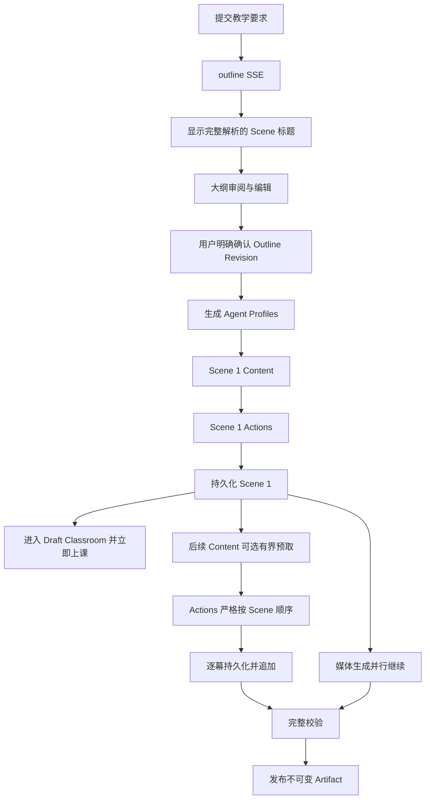

# Chalkboard V3 Handoff

> 文档状态：Accepted
> 文档类型：Active branch handoff
> 适用分支：`feat/chalkboard-v3`
> Worktree：`/home/xcodd/code/chalk_/.worktree/chalkboard-v3`
> 基线提交：`3d49a34c7e65aa87ce0c14748bc7fbf508b62d78`
> 基线来源：Chalkboard V2 PR #6 合并并完成主分支文档维护后的 `origin/main`
> 最后核验：2026-08-28

本文记录 Chalkboard V3 分支的真实工作现场。产品与架构约束仍以
[文档索引](../README.md)列出的权威文档为准；本文只记录分支状态、实施顺序、验证结果和下一步。

## 1. 当前目标

V3 已完成两个纵向切片。第一个切片按固定 OpenMAIC 提交忠实迁移渐进式课堂生成体验：

1. outline SSE 逐步返回已经完整解析的 `SceneOutline`，前端先显示稳定 Scene 标题；
2. 大纲完成后固定停留，允许编辑标题、要点，添加、删除或重排序 Scene，并配置 `quiz` / `interactive`；
   不存在倒计时或自动进入 Scene 生成；
3. 用户明确确认后形成确定的大纲 revision，并在 Scene 1 前生成 3–5 个 Agent 画像（恰好一位教师）；
   后续 content/actions、Draft Discussion 和 Artifact 都使用这组画像；
4. Scene 1 完成 `content -> actions` 后立即进入 owner-scoped Draft Classroom，完整挂载既有课堂
   renderer、播放、浏览器讲解、author-authored discussion、Notes 和 Chat；
5. 后续 Scene 按 OpenMAIC 顺序继续生成并逐幕追加，媒体生成并行继续；
6. 全部必要内容和媒体通过校验后，显式发布一个不可变 Classroom Artifact。

每次提交教学要求时会立即创建稳定的 Classroom，并在左侧课堂列表出现。该入口不等待大纲或整课完成：
点击后会恢复 outline 生成、审阅、等待 Scene 1、渐进课堂或失败状态；发布只在同一 Classroom 下新增
Artifact，不改变 Classroom ID。顶部“生成课堂”始终是创建新课堂的入口，不再绑定最近一个生成任务。

第二个切片迁移 OpenMAIC 的多 Agent 课堂讨论：Scene 1 进入 Draft Classroom 后即可从 authored
Discussion Action 或 Chat 发起同一条 Discussion Session；LangGraph Director 编排教师、助教和课堂
同伴发言，SSE 增量渲染，PostgreSQL 持久化 Transcript 和 `wb_*` Action ledger，支持 FIFO 浏览器
TTS、AI Live Chalkboard、停止、刷新恢复和显式结束后返回课堂位置。

参考实现固定为 OpenMAIC commit
`1466a55eef9e31e229a0e2e60a0811020d7b06e2`。不得重新设计阶段顺序、跨 Scene 依赖、
模型上下文或新的 Scene SSE 协议。

## 2. 从 V2 继承的已完成基线

Chalkboard V2 已通过 GitHub PR #6 合并到 `main`，合并提交为 `82832ee`；V3 从后续主分支提交
`3d49a34` 创建。以下能力是 V3 的现有基线，不在本分支重新实现：

- PostgreSQL 中 owner-scoped Classroom、不可变 Classroom Artifact、Classroom Draft、
  Generation Run、Learning Session 和 Quiz Attempt；
- MinIO 中的图片、音频和视频二进制对象，以及 PostgreSQL 中的稳定 `mediaRef`；
- `.chalk.zip` 原生导入和 `.maic.zip` 兼容导入；归档不是生成或学习的运行时数据源；
- 可恢复的 outline、Scene content、Scene actions 和 media Generation Run，包含数据库 claim、
  lease、heartbeat、retry、abort、稳定错误码和 Prompt/模型审计；
- slide、quiz、interactive content/actions、图片/视频生成、显式发布与前端真实 API 接入；
- DAL SQL owner 条件、owner 复合外键和认证 fail-closed；`admin` 与 `user` 使用相同课堂业务路径；
- 统一 LLM/媒体 Provider 配置和浏览器原生 TTS；Chalkboard 不建立另一套 Provider 定义；
- Classroom Artifact JSON 以 PostgreSQL JSONB 为权威，MinIO 不保存生成 JSON。

V2 的四小时私有媒体签名 URL 是当前已知可靠性缓解。稳定的 owner-scoped HTTP Range 媒体端点
没有实现，也不是渐进式生成首个切片的隐含范围；若后续处理，应作为独立、可审查的基础设施变更。

## 3. 固定生成链路



必须保持以下 OpenMAIC 语义：

- outline SSE 事件为 `languageDirective`、`courseTitle`、`outline`、`retry`、`done` 和 `error`；
  `outline` 只携带完整 `SceneOutline`，不向前端发送原始 token 或半截 JSON；业务事件先持久化，SSE
  使用标准 event ID，客户端以 `Last-Event-ID` 从 owner-scoped PostgreSQL event log 断点续传；
- Content 不读取前一个 Scene 的 content/actions。默认按顺序生成；即使以后启用有界预取，也只能
  预取 content，并保持按 Scene 顺序消费；
- Actions 硬依赖当前 Scene 的真实 Content/元素 inventory，并严格串行。跨页上下文只使用完整
  大纲、当前位置和上一页最后 speech 的末尾 150 个字符；
- Scene content/actions 使用普通请求和 phase callback，不新增 OpenMAIC 不存在的 Scene SSE；
- 浏览器原生 TTS 不创建后端 TTS task；Scene 在 actions 校验并持久化后即可进入预览；
- 失败保留已完成 Scene；恢复或单 Scene 重试从失败 Scene 的 `content -> actions` 开始，不覆盖前序；
- pending/running/failed Scene 占位项可点击，点击后主画布显示该 Scene 的等待、生成或失败状态；
- Worker 默认允许 10 个不同 Classroom Run 并发；同一 Classroom 内 Scene 仍按 revision order 严格顺序；
- Draft Classroom 不是正式 Classroom Artifact，也不创建或推进正式 Learning Session；草稿播放位置与
  小测只允许本机恢复，不能写入正式 Learning Session/Quiz Attempt API。

## 4. 数据、认证与 Prompt 边界

- Requirements/context、Outline Revision、Scene content/actions、运行状态和最终规范化 JSON 继续写
  PostgreSQL；MinIO 只保存媒体二进制；
- SSE 是传输和等待体验，不是权威状态。刷新、断线和进程恢复必须从 owner-scoped PostgreSQL
  Generation Run / Draft 快照及 outline event log 恢复；
- 所有 Draft、Revision、Run、Scene 和媒体查询都必须在 DAL 强制 `userId` 条件；认证异常
  fail closed，不允许默认身份；
- 已发布 Artifact 保持不可变。渐进生成只修改构建中的 Classroom Draft，全部通过后发布一次；
- 产品 Prompt 继续集中在 `apps/api/src/prompts/`，运行时只读取英文版，中文镜像供人审阅；
- 迁移 OpenMAIC Prompt 时保留固定来源、路径和 provenance/hash，非 Chalk 真实接口或安全边界
  所必需，不修改英文原文；
- 继续复用 `@earendil-works/pi-ai` 和当前用户已经配置、可用的 LLM/媒体 Provider，不建立 V3
  专用 Provider catalog。

## 5. 当前明确不做

PBL 不属于 V3：不实现 PBL outline 编辑、content/actions、项目运行时、持久化或兼容降级。

渐进式生成后的第二个切片已经实现 Discussion Transcript、课堂 Chat 后端、Director/参与 Agent、
文本与结构化 Action SSE、浏览器 ASR 输入、FIFO TTS 和 AI Live Chalkboard。以下能力仍不在当前
V3 实现中：

- 学生自由手写白板、Whiteboard Snapshot/History；
- 将 AI Live Chalkboard 提升为有独立 ID、可课后回看或收藏的持久学习单元；
- 原始 token 流、未校验部分 JSON、Scene content/actions SSE；
- IndexedDB/localStorage 权威状态或增量 Classroom Artifact revision；
- 与 OpenMAIC 不同的空间碰撞门禁、跨 Scene 摘要或新的生成编排创新。

[V3 课堂讨论规格](../spec/chalkboard-v3-discussion.md)已经 Accepted；当前实现严格按 Discussion Session、
Round、Transcript Message、Chalkboard Action ledger 和进入前 cursor 的生命周期落地。当前白板是
Discussion Session 内随消息恢复的场景覆盖层，不是学生手写画布，也不产生独立持久学习单元。

## 6. 分支与环境状态

已完成：

- `feat/chalkboard-v3` 从最新 `origin/main@3d49a34` 创建；
- worktree 位于 `/home/xcodd/code/chalk_/.worktree/chalkboard-v3`；
- 分支创建时工作树干净，不复制 V2 的未提交文件、`.env`、数据库或 Provider 凭据；
- V3 handoff 和文档索引已建立；
- V3 独立 `.env`、PostgreSQL（5543）、MinIO（9100/9101）及 API/Web 端口（3101/3102）已建立并验证；
- owner-scoped Outline Candidate/Revision、outline event log/SSE 恢复、逐 Scene content/actions 调度、
  media lane、`previewReady`/`publishReady` 和幂等 Artifact 发布已经贯通；
- Web 已实现流式大纲、完成后固定尺寸审阅编辑、显式确认、逐 Scene 状态与失败恢复；大纲列表内部滚动，
  摘要和底部操作保持固定；
- outline Run 创建时同步创建稳定 Classroom；左侧课堂从生成开始就是恢复入口，`?id=<classroomId>`
  可恢复准确阶段；顶部生成按钮始终开启全新的课堂生成；
- Chat/Chats 切入 Chalkboard 时保持全局侧栏和工作区外壳稳定，课堂数据只在工作区内显示加载状态；
  无 `id` 的全局入口直接打开默认课堂，不再通过补写查询参数重复初始化，Chat 的迟到初始化也不会
  覆盖已经开始的跨页面导航；
- Scene 1 原子完成后在同一 Classroom 页面切入 Draft Classroom；未完成/正在生成/失败 Scene 可点击并
  在主画布显示对应状态，完成 Scene 逐幕加入；正在播放时延迟应用新增 Scene，避免替换 runtime 后重播；
- Worker 默认并发 claim 10 个不同 Classroom Run，但 progressive Run 内仍串行生成 Scene；Draft Classroom
  刷新从 owner-scoped Generation Run 重建，草稿游标/小测仅保存在本机；完整后可在同一稳定 Classroom
  入口显式发布不可变 Artifact；
- Interactive 继续使用严格契约校验；暂不迁移 OpenMAIC 的校验失败自适应重试，也不向下一次 Prompt
  注入失败状态或无效输出，待产品重试上下文另行确认。
- owner-scoped Discussion Session/Round/Transcript、TypeScript LangGraph Director/Participant 图、
  `@earendil-works/pi-ai` 模型 adapter、Fastify SSE，以及 Draft/正式课堂共用的右侧 Discussion 面板
  已贯通；课堂讨论统一位于右侧栏并显示本课 Agent 画像，逐条 Agent 文本持久化，浏览器 TTS 按 FIFO
  串行播放，停止后保留 interrupted 内容，刷新恢复身份、记录和 `wb_*` Action ledger，结束后恢复
  cursor；AI Live Chalkboard 已支持文本、公式、形状、表格、图表、线条和代码块。

尚未执行或不在本切片内：

- 未执行使用真实付费 LLM/图片/视频 Provider 的端到端 smoke；自动化生成 E2E 使用可控 mock；
- 学生自由手写白板和可收藏的独立持久白板单元仍不在当前讨论切片；
- PBL 不属于整个 V3 范围。

需要启动完整环境时，按 [worktree 开发手册](../runbooks/worktree-development.md)从
`.env.example` 创建 V3 自己的 `.env`，选择未占用端口和独立 Compose project；不得复制 V2 `.env`
或复用其数据库、MinIO volume、session 路径和凭据。

## 7. 第一个纵向切片

修改代码前的两项门禁已于 2026-08-27 完成：

1. [V3 渐进式课堂生成规格](../spec/chalkboard-v3-generation.md)已经审阅并转为 Accepted；
2. 已对照固定 OpenMAIC commit 的源码和测试，锁定 outline SSE parser/event、只读流中审阅、
   第一幕切换、后续 Scene/媒体调度和失败重试的精确行为；其中自动继续已按当前 Chalk 产品决定改为
   显式确认，证据与差异见
   [OpenMAIC V3 渐进式生成迁移调研](../researsh/openmaic-v3-progressive-generation.md)。

本分支已经使用 TDD 交付贯通 outline 到全部 Scene 和发布门禁的纵向切片：

1. 为 Outline Revision、Draft Classroom、逐 Scene 调度、媒体/发布衔接和全阶段恢复语义写失败的
   domain/DAL/integration tests；
2. 在现有 `classroom-generation` 模块内按职责新增或深化 Service，不把 SSE、Revision、Scene 调度
   重新堆进同一个文件；Route 只处理认证、Zod、SSE header/事件发送和 Service 调用；
3. 实现 owner-scoped Outline Revision 持久化及完整 SceneOutline 事件，不持久化原始 token；
4. 实现前端大纲生成进度和完整审阅编辑，所有编辑经服务端契约校验并产生确定 revision；V3 契约
   明确拒绝 PBL；
5. 让确认后的 Scene 1 完成 `content -> actions` 后进入内容只读、运行能力完整的 Draft Classroom，
   并在同一链路中按默认
   串行语义生成和逐幕追加全部剩余 Scene；V3 调度必须按 Scene 交替执行 content/actions，不能沿用
   V2 的“全量 content 后全量 actions”用户流程；
6. 进入 Draft Classroom 后并行启动 revision 规划的媒体 lane，复用既有 Generation Run、Provider、
   MinIO 和稳定 `mediaRef`，媒体任务创建不再等待全课 actions aggregate 完成；必要媒体失败阻止发布
   但不移除已完成 Scene；
7. 全部 Scene/必要媒体通过校验后进入可发布状态，接通现有幂等显式发布并打开不可变 Artifact；
8. integration/E2E 证明匿名拒绝、跨 owner 404、断线/刷新/进程恢复、revision 绑定、第一幕提前出现、
   后续逐幕追加、任意 Scene 失败保留/重试、媒体门禁和重复发布幂等；
9. 同步 V3 generation spec、本文 handoff 和受影响的架构/runbook；运行 migration、unit、integration、
   typecheck、lint、build 和 Chalkboard E2E。

收尾审查进一步补齐了三条并发边界：大纲确认携带服务端 Candidate Version，过期审阅提交稳定返回
409；Agent Profiles 不再在幂等入队前调用模型，而是作为 Progressive Worker 取得数据库租约后的第一
阶段生成并持久化；同一 revision 的并发确认不会重复产生付费画像调用。

第一个切片不实现 content 并行预取；第二个切片已经接通实时多 Agent 讨论与 AI Live Chalkboard。
课堂 Discussion Action、学生追问、Notes、共享 Transcript Chat、浏览器 ASR/TTS 和讨论白板均可在
Scene 1 就绪后使用。学生自由手写白板不在当前切片；PBL 不是后续 V3 切片，而是整个 V3 的非目标。

## 8. 第二个纵向切片：课堂讨论

第二个切片已按 [V3 课堂讨论规格](../spec/chalkboard-v3-discussion.md)实现：

1. `classroom-discussions` 使用 TypeScript LangGraph 表达 Director → Participant → Director 循环，
   每 Round 最多三次 Agent 发言；authored 议题由指定 Agent/教师开场，学生自由发言先经 Director 判断，
   未解决问题路由教师，纯确认可以直接 `END`；Director 输出仅允许课堂参与者、`USER` 或 `END`；
2. LangGraph 只负责编排，模型继续经过 `@earendil-works/pi-ai`；通用 Agent 仍使用 `pi-agent-core`，
   决策与锁定版本见 [ADR 0001](../adr/0001-langgraph-for-classroom-discussion.md)；
3. Discussion Session 精确绑定 Learning Session 或 Generation Run 与 Scene；Session、Round、Message
   使用 owner 复合外键和 DAL owner 条件，认证缺失 fail closed、跨 owner 返回 404；
4. Fastify 暴露创建/恢复、当前 Session、Round SSE、停止与结束端点；每个可见文本增量持续写库，
   中断内容标为 `interrupted`；运行 Round 的实例租约、心跳与停止请求以数据库为权威，多 API 实例
   可以停止同一轮，Session 结束不会越过仍在运行的 Round，恢复任务只收口心跳过期的工作；
5. 右侧课堂讨论面板使用同一后端 Transcript，显示初始化时生成的 Agent 名称/角色/persona，支持浏览器
   语音输入、authored Action 确认后由可信首位 Agent 开场、FIFO TTS、停止、错误重试、刷新恢复和
   结束后回到进入前课堂位置；页面底部不再存在重复 Discussion Dock；
6. Discussion Message 持久化结构化 `wb_*` Action ledger，SSE 顺序投影到 AI Live Chalkboard；刷新、
   Scene 往返和多 Agent 连续发言都从同一 ledger 恢复，不把白板 JSON 当作普通文本展示；
7. Director Prompt 忠实保留固定 OpenMAIC 来源，Participant Prompt 在 Chalk 的可信 Action 边界内恢复
   结构化白板协议；英文运行版、中文审阅版与 provenance/hash 均已注册和测试。

当前刻意保留 OpenMAIC 的 Prompt Builder 边界：Director/Participant 主体在 Prompt 资产中，动态
discussion section、角色、长度与白板规则仍由 Graph 周边 TypeScript builder 装配。把这些稳定字符串
进一步迁入双语模板属于后续独立 Prompt 变更，必须先补真实 Provider 的课堂套路 eval；不要把它混入
“忠实迁移”diff。Agent Profiles 与旧 Artifact 的受控 fallback 同样按这条边界处理。

## 9. 当前验证

当前实现实际执行：

```bash
pnpm --filter @chalk/api test:unit
DATABASE_URL="$TEST_DATABASE_URL" NODE_ENV=test \
  pnpm --dir apps/api exec vitest run tests/integration/classroom-discussions.test.ts --maxWorkers=1
pnpm --filter @chalk/api test:integration
pnpm --filter @chalk/api typecheck
pnpm --filter @chalk/web typecheck
pnpm exec eslint <本次受影响的 Web/测试路径> --max-warnings=0
E2E_WEB_URL=http://localhost:3102 E2E_API_URL=http://localhost:3101 \
  pnpm exec playwright test tests/e2e/chalkboard.spec.ts tests/e2e/chalkboard-navigation.spec.ts
pnpm --filter @chalk/web build
pnpm --filter @chalk/api build
git diff --check
```

截至 2026-08-28，API unit 87/87、Agent Runtime unit 44/44、Chalkboard package unit 44/44；
完整 API integration 96/96（包括 10 个课堂 Run 并发门禁、Candidate Version、并发确认只生成一次
Agent Profiles、稳定
Classroom 身份、生成中课堂列表，以及多 Agent SSE、停止/部分
内容恢复/结束、Draft 目标绑定、陈旧 Round 恢复、Agent 画像进入生成与发布链路）；
Chalkboard E2E 27/27、全仓 typecheck/lint、API/Web production build 和全量 `git diff --check` 均
通过；全部 migration 也在测试数据库顺序执行成功，并已应用到 V3 开发数据库。
Generation E2E 覆盖稳定 Classroom URL、左侧生成状态恢复、大纲明确确认、Scene 1 自动进入 Draft
Classroom、可点击 pending Scene 状态页、完整课堂操作、后续 Scene 逐幕追加、播放时不重放讲解、
讨论 TTS FIFO、刷新恢复、同页发布及最终 Artifact。未用真实付费 Provider 执行 smoke，不能把 mock
E2E 视为真实模型/媒体验证。

## 10. 继续工作前阅读

- [文档索引与权威顺序](../README.md)
- [V3 渐进式课堂生成规格](../spec/chalkboard-v3-generation.md)
- [V3 课堂讨论规格](../spec/chalkboard-v3-discussion.md)
- [课堂讨论 LangGraph 决策](../adr/0001-langgraph-for-classroom-discussion.md)
- [V2 最终 handoff](./chalkboard-v2.md)
- [API 后端分层](../architecture/backend-layers.md)
- [Prompt 管理规范](../architecture/prompts.md)
- [Chalkboard V1 课堂运行时](../spec/chalkboard-v1-runtime.md)
- [Chalkboard V1 内容生成](../spec/chalkboard-v1-generation.md)
- [worktree 开发手册](../runbooks/worktree-development.md)
- [数据库开发手册](../runbooks/database-development.md)
