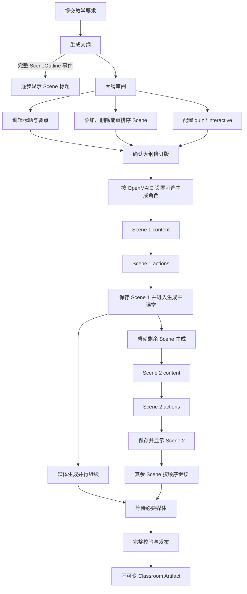

# Chalkboard V3 渐进式课堂生成

> 文档状态：Draft
> 适用范围：Chalkboard V3 产品能力；不属于 Chalkboard V1/V2 实施范围
> 已确认边界：V2 保留现有可恢复分阶段生成；本规格中的审阅、流式预览和逐 Scene 呈现延后到 V3
> 参考来源：OpenMAIC 固定提交 `1466a55eef9e31e229a0e2e60a0811020d7b06e2`
> 迁移原则：忠实迁移 OpenMAIC 生成链路，不重新设计阶段顺序、跨 Scene 依赖或模型上下文

## 目标

V3 在不改变服务端持久化、owner 隔离和不可变 Classroom Artifact 约束的前提下，改善课堂生成的等待体验：

1. 大纲生成过程中逐步显示已经完成解析的 Scene 标题；
2. 大纲完成后允许用户在生成课堂内容前审阅和编辑；
3. 第一幕的 content 和 actions 都完成后即可预览，后续 Scene 继续生成并逐幕出现；
4. 将 OpenMAIC 浏览器侧的生成恢复语义适配到 Chalk 的 PostgreSQL Generation Run，而不改变其产品链路。

## 用户流程



### 大纲生成与审阅

- 沿用 OpenMAIC 的 outline SSE 事件语义：`languageDirective`、`courseTitle`、`outline`、`retry`、
  `done` 和 `error`。`outline` 事件只携带已经解析出的完整 `SceneOutline`，不把原始 token 或
  半截 JSON 当成产品数据。
- 生成过程中首先展示稳定的 Scene 标题，减少等待感；完整大纲仍以 PostgreSQL 中的服务端结果为权威。
- 与 OpenMAIC 一样，用户可以在 SSE 尚未结束时展开审阅界面，SSE 继续补充后续 Scene；大纲完成后
  可以进入完整审阅，也可以按设置自动继续。
- 审阅界面允许编辑 Scene 标题和要点，添加或删除 Scene，以及调整顺序。
- `quiz` 和 `interactive` 的类型专属选项在审阅步骤配置；选项必须经过服务端契约校验。
- 用户确认后形成一个确定的大纲 revision。后续 content/actions 都绑定该 revision；再次修改必须产生新 revision，不能静默改写正在生成的输入。

### 逐 Scene 生成

每个 Scene 内部保持明确顺序：

```text
Scene outline
  -> Scene content
  -> Scene actions
  -> optional non-browser TTS
  -> add completed Scene
```

- content 先确定这一幕的可渲染内容和稳定元素标识；actions 再引用这些真实元素编排教师讲解和互动，因此 actions 不能先于 content。
- 同一 Scene 的 content 或 actions 未通过契约校验时，该 Scene 不进入可预览状态，也不得用服务端伪造内容兜底。
- **Content 没有跨 Scene 依赖。** OpenMAIC 的 content 输入是当前 `SceneOutline` 及课程、媒体、
  角色和语言配置，不读取前一个 Scene 的 content 或 actions。默认按顺序请求；启用
  `PARALLEL_SCENE_CONCURRENCY > 1` 时只允许 content 有界预取，并仍按 Scene 顺序消费结果。
- **Actions 对当前 Content 是硬依赖。** Action Prompt 读取当前 Scene 的真实元素、题目或
  interactive element inventory；同时只使用完整大纲标题、当前位置，以及上一页的 speech 文本
  维持过渡。OpenMAIC 注入的是上一页最后一段 speech 的末尾 150 个字符，不是自创的 Scene 摘要，
  也不传入前面所有 Scene JSON。
- Actions 严格按 Scene 顺序生成。每幕完成后更新 `previousSpeeches`，下一幕才生成 Actions；这条
  串行约束不能因 content 预取而放宽。
- OpenMAIC 先在 generation preview 中完成第一幕的 `content -> actions -> optional TTS`，保存
  Scene 后进入课堂；课堂页再继续剩余 Scene。后续每完成一幕就立即追加，不等待整门课堂结束。
- OpenMAIC 在进入课堂后并行启动大纲已经规划的媒体生成，它不阻断 content/actions 主循环。
  Chalk 继续迁移这项行为及其占位引用，不改成新的媒体编排流程。
- Chalk 已确认使用浏览器原生 TTS，因此命中 OpenMAIC 的 `browser-native-tts` 分支：speech 不创建
  后端 TTS 任务，Scene 在 actions 校验并持久化后即可加入预览。
- 失败时保留已经完成的 Scene；恢复或单 Scene 重试仍从该 Scene 的 `content -> actions` 开始，
  不覆盖已经完成的前序 Scene。

## 状态、事件与恢复边界

- SSE 只用于 OpenMAIC 已有的 outline 流。OpenMAIC 的 Scene content/actions 使用普通请求和客户端
  phase callback，不建立 Scene SSE；Chalk V3 不额外发明一套 Scene 流式协议。
- Chalk 后端任务继续使用现有 owner-scoped Generation Run、Scene 状态和轮询快照提供后台执行与
  恢复。客户端刷新后从 PostgreSQL 快照恢复，不依赖浏览器保存权威状态。
- outline SSE 断开不改变 PostgreSQL 中已经提交的 Run 状态；重连、重试和取消需要保持 OpenMAIC
  `retry/done/error` 的产品语义，同时复用 Chalk 已有的 lease、heartbeat 和明确终态。
- 认证异常必须 fail closed，所有 Draft、Run、Scene 和大纲 revision 查询继续由 DAL 强制 owner 条件。

## 持久化与发布边界

- Requirements/context、大纲 revision、Scene content/actions、运行状态和最终规范化 JSON 继续以 PostgreSQL 为权威存储。
- MinIO 继续只保存图片、音频、视频等二进制媒体；SSE 和逐 Scene 预览不改变这一分工。
- `.chalk.zip` 仍是按需组装的导出/导入交换格式，不是生成过程的数据源。
- V3 不得为了“第一幕先看”而把未完成 Classroom Draft 冒充完整 Classroom Artifact，也不得修改已发布 Artifact。
- OpenMAIC 把逐步生成的 Scene 写入构建中的可变 Stage；Chalk 对应地写入 owner-scoped
  Classroom Draft，并通过只读 Draft Preview 呈现。这里不创建连续的 Artifact revision。
- 全部必要 Scene 和媒体完成并通过校验后，才从 Draft 显式发布一个不可变 Classroom Artifact；
  正式 Learning Session 仍只绑定该 Artifact。Draft Preview 不创建或推进正式 Learning Session。

## 迁移门禁

1. 用固定 OpenMAIC 提交的源码测试锁定 outline SSE 事件类型、审阅状态和 Scene 阶段顺序；
2. 锁定第一幕完成后进入课堂、剩余 Scene 在课堂页继续生成的行为；
3. 锁定 content 无跨 Scene 依赖、actions 只读取当前 content 与上一页 speeches 的上下文形状；
4. 锁定 content 有界预取可选且默认关闭、actions 严格串行的调度语义；
5. 将 OpenMAIC 的浏览器 Stage 构建状态映射为 PostgreSQL Classroom Draft，不改变生成产品流程；
6. 保留 Prompt 英文原文与 provenance；只有 Chalk 的认证、存储、Provider 和运行契约要求时才做
   可单独审查的最小适配；
7. integration/E2E 证明第一幕出现、后续幕追加、失败保留与刷新恢复均经过正式后端链路。

本文档经评审转为 `Accepted` 之前，不修改 V2 的现有生成 API、发布契约或学习运行时。

## 非目标

- 不把原始 LLM token 或未校验的部分 JSON 直接交给前端；
- 不用 IndexedDB 或 localStorage 作为大纲、Scene 或 Generation Run 的权威存储；
- 不让后一个 Scene content 依赖自创的前文摘要、前序 content 或前序 actions；
- 不为 Scene content/actions 新增 OpenMAIC 不存在的 SSE 链路；
- 不在生成过程中创建增量 Classroom Artifact revision；
- 不在本规格中引入课堂实时讨论、Discussion Transcript、AI 老师对话或 live whiteboard；
- 不放宽 Classroom Artifact 的不可变性、DAL owner 校验或认证 fail-closed 约束；
- 不建立另一套 LLM/媒体 Provider 配置，继续复用 Chalk 已配置且当前用户可用的 Provider。
