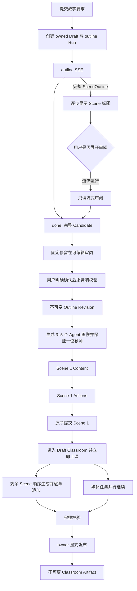

# Chalkboard V3 渐进式课堂生成

> 文档状态：Accepted
> 适用范围：Chalkboard V3 产品能力；不属于 Chalkboard V1/V2 实施范围
> 已确认边界：V2 保留现有可恢复分阶段生成；V3 迁移大纲流式审阅与逐 Scene 呈现
> 参考来源：OpenMAIC 固定提交 `1466a55eef9e31e229a0e2e60a0811020d7b06e2`
> 迁移原则：忠实迁移 OpenMAIC 已有产品链路，只为 Chalk 的认证、持久化、Provider、严格契约和不可变 Artifact 边界做最小适配
> 最后核验：2026-08-28

本文定义两个从 OpenMAIC 迁移到 Chalk 的产品能力：

1. outline 的增量解析、SSE 呈现、审阅编辑与确认；
2. 第一幕完成后进入完整的 Draft Classroom，剩余 Scene 在课堂中继续生成并逐幕追加。

V3 的 Scene 类型范围固定为 `slide | quiz | interactive`。PBL 不属于 V3，本规格及 V3 的任何实施
切片都不建立 PBL 的编辑、生成、运行或持久化能力。

OpenMAIC 的源码行为与 Chalk 适配依据见
[OpenMAIC V3 渐进式生成迁移调研](../researsh/openmaic-v3-progressive-generation.md)。本文是 Chalk
实现和验收的权威规格；调研文档负责证明来源，不替代本文的产品约束。

## 1. 已确认决策

- 保持 OpenMAIC 的阶段顺序，并按 Chalk 已确认的审阅门禁适配为：`outline -> explicit review confirmation -> agent profiles -> Scene 1 content -> Scene 1 actions
  -> Draft Classroom -> remaining Scenes`；不重新设计为另一条生成链路。
- outline 使用 SSE；Scene content/actions 继续使用普通生成任务和阶段状态，不新增 Scene SSE。
- SSE 只发送已经闭合、可独立解析并通过 SceneOutline 契约的对象，不发送原始 token、半截 JSON
  或未经校验的模型输出。
- 只有用户明确确认时，服务端才从当时的完整大纲创建一个不可变 Outline Revision；所有
  Scene 和媒体任务绑定该 revision。
- Outline Revision 创建后、Scene 1 开始前必须生成 3–5 个课堂 Agent 画像；必须且只能有一位教师。
  模型失败时使用包含教师、助教和课堂同伴的受控 fallback，不能跳过画像阶段或等到讨论时临时编造角色。
- 第一幕在 content 和 actions 都校验并提交后即可进入 owner-scoped Draft Classroom。课堂内容仍是
  只读草稿投影，但既有 renderer、播放、浏览器教师语音、author-authored discussion、Notes、Chat
  和本机草稿小测均可立即操作；Chalk 使用浏览器原生 TTS，因此不等待后端 TTS。
- 后续 Scene 默认顺序生成；可选并发只预取 content。Actions 始终一次一个、按大纲顺序消费，
  并只读取当前 Scene 的真实 content inventory 和前一页 speech 过渡上下文。
- 全局 Generation Worker 默认同时 claim 最多 10 个不同课堂的 Run，使多个 Classroom 可以并发调用
  模型；这个并发上限不改变单个 Classroom 内 `content(N) -> actions(N) -> commit(N)` 的顺序。
- OpenMAIC 的浏览器 Stage、sessionStorage 和 IndexedDB 只作为来源行为参考。Chalk 的权威状态
  必须在 PostgreSQL，媒体二进制必须在 MinIO，认证和 owner 校验必须 fail closed。
- Draft Classroom 不是 Classroom Artifact，也不是正式学习过程。只有全部必要 Scene 与媒体通过
  校验并由 owner 显式发布后，才创建不可变 Artifact 和正式 Learning Session。
- 第一个纵向切片必须贯通上述完整生成链路，而不是只做 Scene 1 原型：Scene 1 仍是提前进入
  Draft Classroom 的产品切换点，但同一切片继续生成全部剩余 Scene、处理必要媒体并接回现有显式发布。

## 2. 来源行为与 Chalk 适配

| 能力 | OpenMAIC 固定提交中的行为 | Chalk V3 决策 |
|---|---|---|
| outline 增量呈现 | 服务端从增长中的 JSON 文本提取完整对象，并通过 SSE 逐条发送 | 保持事件和解析节奏；对象先通过 Chalk 契约并提交快照，再对 owner 可见 |
| 流中审阅 | 用户可在 SSE 期间展开编辑器，但编辑器只读，SSE 继续补充 Scene | 原样迁移；`done` 前禁止编辑和确认 |
| 审阅选择 | `reviewOutlineEnabled` 或流中主动展开会停在审阅；否则等待 2.5 秒自动继续 | Chalk 有意收紧为显式确认：大纲完成后固定停留，不存在倒计时或自动确认 |
| 大纲编辑 | 编辑标题、描述、要点，增删、重排、切换类型并配置类型参数 | V3 只迁移 `slide`、`quiz`、`interactive`；不开放 `pbl` |
| 首幕生成 | generation preview 只生成第一幕 content/actions，必要时生成非浏览器 TTS，保存后跳入课堂 | content/actions 成功提交 PostgreSQL 后进入 Draft Classroom 并启用既有课堂运行能力；浏览器 TTS 不创建 task |
| 剩余幕生成 | 课堂页恢复 pending outlines，媒体并行，逐幕加入可变 Stage | 后端从 PostgreSQL revision/Draft 恢复，逐幕提交并推送快照；不依赖页面存活 |
| 并发 | 默认关闭；启用后只预取 content，actions/TTS 串行消费 | 不启用单课堂 content 预取；Worker 允许最多 10 个不同课堂的 Run 并发，课堂内部仍保持 Scene/actions 顺序 |
| 失败恢复 | 保留完成 Scene，单幕从 content 开始重试，然后恢复剩余生成 | 保留语义；由 Generation Run 的 claim/lease/attempt 和稳定错误码实现 |
| actions fallback | actions 为空时部分类型会生成本地默认动作，slide 还可能改绑无效 target | 有意收紧：无效/空 actions fail closed，不伪造教学行为或静默改绑 target |
| 最终内容 | 可变 Stage 逐步保存 | owner-scoped Classroom Draft 逐步保存；通过完整门禁后显式发布一次 Artifact |

Chalk 不迁移以下 OpenMAIC 浏览器实现细节：Provider 凭据 header、sessionStorage 中的
`generationSession/generationParams`、IndexedDB Stage、浏览器作为后台调度器、匿名设备身份，以及
客户端断线即中止并丢弃权威生成状态。这些都与 Chalk 已接受的后端和数据边界冲突。

## 3. 领域对象与状态边界

### 3.1 Outline Candidate

Outline Candidate 是当前 outline Generation Run 某次自动尝试产生的工作快照：

- 可以在生成过程中包含从前到后连续的若干完整 SceneOutline；
- `retry` 时由新尝试整体替换，不能把不同尝试的 Scene 混在一起；
- `done` 后包含规范化的 `languageDirective`、`courseTitle` 和完整 SceneOutline 列表；
- 它可以被审阅，但尚未被确认时不能作为 Scene 生成输入；
- 它不是 Outline Revision，也不具有发布语义。

### 3.2 Outline Revision

Outline Revision 是用户明确确认时由服务端创建的不可变生成输入：

- revision 归属于一个 `userId + Classroom Draft`；
- 保存完整大纲、确定的 Scene ID/order/type/config、来源 Candidate、确认时间和内容 hash；
- 同一确认请求必须幂等，重复请求返回同一 revision；
- revision 创建后不得原地修改。再次编辑必须从已有大纲派生新的 working copy，再确认成新 revision；
- 已经开始生成 content/actions 的 revision 不允许被另一个 revision 静默替换；用户要改大纲时必须
  明确启动新的生成分支，既有已发布 Artifact 和 Learning Session 不受影响；
- Scene content、Scene actions、媒体任务、Prompt/模型审计和最终发布都必须能追溯到 revision ID。

### 3.3 Draft Classroom

Draft Classroom 是 Classroom Draft 的 owner-scoped 运行投影。它的 Scene 内容只读，但不是只能观看的
预览弹窗：

- Classroom 在提交教学要求、创建 outline Run 时即获得稳定 ID 并出现在 owner 的课堂列表；Draft、
  Generation Run 和最终 Artifact 都挂在该 Classroom 下，发布不更换 Classroom ID；
- 左侧课堂列表是进入该 Classroom 当前状态的稳定入口。离开后再进入时，outline 生成、outline 审阅、
  等待 Scene 1、渐进课堂或失败页均从 PostgreSQL 快照恢复；顶部“生成课堂”只创建新 Classroom，
  不承载或恢复某一个当前任务；
- 从 Chat、Chats 或全局 Chalkboard 入口切换时，应用侧栏和工作区外壳必须保持可见；课堂列表、Artifact
  和 Learning Session 的等待状态只在 Chalkboard 工作区内反馈，不能用全屏加载页替换产品导航。
  无 `id` 的全局入口可直接打开列表中的默认课堂，不得为了补写查询参数重启同一次课堂初始化；
- 只投影绑定同一 Outline Revision 且 actions 已完成的 Scene；
- Scene 按 revision 中的 order 呈现；pending/running/failed Scene 显示明确状态或骨架，不伪造内容；
- pending、running 和 failed 占位 Scene 均可点击；主画布显示该 Scene 的等待、生成或失败状态，
  已经完成的前序 Scene 仍可播放和讨论；
- 使用既有 Chalkboard renderer 和 Action runtime 运行已经完成的 Scene；播放、暂停、逐动作讲解、
  浏览器 TTS、author-authored discussion、Notes、Chat 和可交互 Scene 不等待全课完成；
- 草稿播放位置与草稿小测可保存在当前浏览器，用于刷新恢复，但不得调用正式 Learning Session、
  Quiz Attempt 或 Playback Cursor API，也不得把这些本地状态冒充服务器学习记录；
- 可以刷新、换浏览器或在 API/worker 重启后从 PostgreSQL 恢复；
- 发布前后的 Classroom 路由保持同一个稳定 Classroom ID；发布成功后该入口解析到确定的不可变
  Artifact，后续正式学习进度才绑定该 Artifact，而生成中的 Draft 本身仍不创建正式学习记录。

## 4. 用户流程



Agent 画像阶段是课堂初始化的一部分。它和 OpenMAIC 一样位于确认大纲与生成第一幕之间，结果保存到
Draft context，并同时进入 Scene Action Prompt、Draft Classroom、Discussion Session 和最终 Artifact。
模型生成失败时使用受控 fallback，但教师角色仍是硬约束。

## 5. Outline SSE 契约

### 5.1 事件集合

沿用 OpenMAIC 的 JSON `type` 事件；每个持久化业务事件的 SSE frame 使用标准 `id` 和
`data: <json>\n\n`，另允许发送不带产品数据、也不持久化的 heartbeat comment：

| `type` | 必需数据 | 语义 |
|---|---|---|
| `languageDirective` | `data: string` | 当前自动尝试中首次完整解析的课程语言指令 |
| `courseTitle` | `data: string` | 当前自动尝试中首次完整解析、trim 且限长的课程标题 |
| `outline` | `data: SceneOutline`, `index: number` | 当前尝试中新完成的一个 SceneOutline；`index` 从 0 连续递增 |
| `retry` | `attempt: number`, `maxAttempts: 3` | 当前尝试没有得到可接受大纲并将自动重试；客户端清空该尝试的瞬时列表 |
| `done` | `outlines`, `languageDirective`, `courseTitle` | 成功尝试的完整、规范化 Candidate，是该次流的最终集合 |
| `error` | 稳定公开错误 | 三次尝试均失败或 Run 进入失败终态；不泄露 Provider 原始错误或输出 |

事件类型和阶段不能被扩展成原始 token、`partialJson`、Scene content/actions stream 或另一个前端
生成协议。客户端重连发送 `Last-Event-ID`，服务端从 owner-scoped PostgreSQL event log 重放其后的
事件；事件 ID 只是传输游标，不能取代 Draft、Run 或最终 Candidate 作为业务权威状态。

### 5.2 增量解析和尝试

- parser 必须正确处理字符串内的 `{}`、转义字符、Markdown code fence，以及 wrapper object 中的
  `outlines` 数组；只在顶层 Scene 对象闭合后尝试 JSON parse。
- 每个 `outline` 在发送前必须完成 order 归一化、Scene ID 唯一性处理、类型适配和 per-scene
  schema 校验。不能把随后才发现无效的对象先作为稳定 Scene 展示。
- 一次 Run 最多自动尝试三次，与固定 OpenMAIC 行为一致。第 1 或第 2 次失败时发送 `retry`；新尝试
  从空 Candidate 开始，旧尝试的 directive、title 和 outlines 都不能泄漏进新尝试。
- `done.outlines` 是成功尝试的规范化全集。客户端必须用它替换而不是盲目追加瞬时 `outline` 列表，
  以接收最终的 ID、order 和媒体 placeholder 去重结果。
- Chalk 继续使用当前严格的 wrapper contract：`languageDirective`、`courseTitle`、`outlines` 都必需
  且必须通过完整服务端 schema；不迁移 OpenMAIC 对裸数组、缺失标题或默认语言的宽松兜底。
- outline 模型流沿用 300 秒请求上限、512 KiB 累计文本上限和 15 秒 heartbeat。达到上限、结构无效
  或截断时记录稳定错误，不能无限累积 buffer，也不能把截断结果当作 `done`。

### 5.3 持久化、断线和重连

- 创建 SSE 连接前先认证；Run、Draft 和 Candidate 的 owner 条件进入 DAL SQL。匿名返回 401，
  其他 owner 访问同一资源返回 404。
- Outline worker 生命周期不绑定浏览器连接。客户端断开只结束该订阅，不取消或回滚 PostgreSQL 中
  的 Run；显式 abort 才请求取消生成。
- `languageDirective`、`courseTitle`、`outline`、`retry` 和 `error` 先写入 owner-scoped event log，SSE
  route 只投影已经提交的记录；`done` 与完整 Candidate、Draft 和 Run 成功终态在同一事务中提交。
  因此刷新时数据库状态不会落后于已经展示为稳定的内容。
- 重连携带 `Last-Event-ID`，服务端先按递增 event ID 重放 owner-scoped Run 的后续记录，再继续 tail；
  客户端按 event ID 去重，不能产生重复 Scene。用户显式 retry 会清除旧 attempt 的可重放事件并从
  新的事件序列重新开始，避免刷新后恢复已失败 attempt 的终态。
- 若重连时 Run 已完成或失败，直接由 PostgreSQL 快照恢复 `done` 或 `error` 视图，不重新调用模型；
  用户显式 retry 才开始新的持久化 attempt。

## 6. 大纲审阅和确认

### 6.1 流中审阅

- 用户点击流式大纲卡片后立即展开完整审阅表面，已经完成的 Scene 可见，SSE 继续追加。
- `done` 之前编辑器严格只读；添加、删除、拖拽、切换类型和确认按钮均禁用。
- 用户在流中收起编辑器只改变当前面板形态，不表示允许自动确认。
- 无论用户是否在流中保持编辑器展开，`done` 后都停留在可审阅状态；Scene 生成只能由明确确认触发。

### 6.2 完成后审阅

- 大纲完成后展示完整 Candidate，并明确说明只有确认后才开始生成 Scene；
- 用户进入编辑器后停留到确认、收起或返回；收起不会确认，也不会启动任何倒计时；
- 刷新恢复 `outline-ready` 或 `review` 时继续停留在大纲阶段，不重新调用模型或触发 Scene 生成；
- 返回教学要求不会确认 revision，也不会因服务端后台任务自动开始 Scene 生成。

### 6.3 编辑能力

完成后允许：

- 编辑 Scene `title`、`description` 和 `keyPoints`；
- 在任意位置添加 Scene、删除 Scene、拖拽或键盘重排；每次变更重新规范化连续 `order`；
- 在 `slide`、`quiz`、`interactive` 之间切换；切换类型时删除原类型专属字段，不能保留 stale config；
- `quiz` 配置题目数 1–10、难度 `easy | medium | hard`，以及至少一种题型
  `single | multiple | text`；从其他类型切入时默认 `3 / medium / [single]`；
- `interactive` 配置 `simulation | diagram | code | game | visualization3d` 和 concept；从其他类型
  切入时默认 `simulation`，切换 widget type 时只保留共享 concept，不携带旧类型专属配置。

PBL 不属于 V3。服务端即使为兼容导入或旧数据仍能解析 `pbl`，V3 的 Candidate、Revision、编辑、
Scene 调度和发布前生成契约也必须明确拒绝它，不能隐藏入口后继续接受，也不能降级成 slide。

OpenMAIC 编辑器只用空标题阻止确认；Chalk 还必须满足当前服务端严格 Outline contract，包括非空
description、至少一个 keyPoint、唯一 ID、连续 order、类型配置、媒体 capability 和全课程媒体元素 ID
唯一性。Web 与服务端必须共享或等价实现这些规则，逐字段显示错误；服务端永远重新校验，不信任前端。

### 6.4 确认并创建 revision

- 显式确认调用唯一的服务端确认用例，提交完整 working outline 和 Candidate 的并发版本；
- 过期 working copy 返回稳定 409，不能覆盖较新的服务端 Candidate/revision；
- 服务端完成 Zod/业务校验、规范化和内容 hash 后，在事务中创建 revision 并把 Draft 绑定到它；
- 事务成功前不得创建 Scene Run；成功后重复相同 idempotency key 返回同一 revision；
- revision 创建后，前端只能显示服务端返回的规范化版本，不能继续使用本地未确认对象开始生成。

### 6.5 界面韧性与无障碍

- SSE 新增 Scene 和状态变化使用 `aria-live="polite"` 宣告，但不能抢走当前焦点、反复朗读整个列表
  或因自动滚动把键盘/读屏用户移出正在查看的位置。
- 流式卡片、展开/收起、增删、类型选择、配置、重排、确认和重试都必须可仅用键盘完成；重排提供
  明确的键盘操作与完成反馈，不能只有拖拽手势。
- 只读、disabled 和 validation 状态不能只靠颜色表达。确认不可用时显示具体原因，并把字段错误放在
  对应输入附近；服务端 400/409 后保留全部编辑内容和焦点上下文。
- 标题、描述、要点和错误文本支持 CJK、RTL、emoji、长单词和至少 200% 文本缩放；移动端不能出现
  横向溢出，类型配置与主要操作不能被截断或只能 hover 发现。
- 生成面板在 outline 流式增长时保持固定尺寸；摘要和底部操作固定，大纲列表或编辑器拥有内部滚动，
  不能因新增 Scene 让面板持续变大或把确认按钮推离视口。SSE subscription、AbortController 和
  live-region 状态在收起、离开或卸载时正确清理。
- 断网、慢网、timeout、401、404、409、429 和 5xx 显示不同且可行动的状态；可安全恢复的错误提供
  retry，认证错误引导重新登录，owner 404 不泄露资源存在性。
- 大纲为空、等待首个 Scene、达到 120 Scene 上限、全部 Scene 被删除以及超长列表都必须有明确
  empty/limit/loading 状态；长列表渲染不能让持续 SSE 更新阻塞编辑器。
- 所有用户可见文案使用现有 i18n，不硬编码中文或英文；动画尊重 `prefers-reduced-motion`，高对比模式
  下仍能区分类型、进度、失败和当前 Scene。

## 7. 逐 Scene 生成

### 7.1 单幕阶段和上下文

每个 Scene 的固定阶段为：

```text
confirmed SceneOutline
  -> content
  -> actions
  -> optional non-browser TTS
  -> commit completed Scene
```

- content 先产生当前类型的可渲染内容和稳定元素标识；actions 只能引用该真实 content、题目或
  interactive DOM inventory。
- content 输入包含当前 SceneOutline、完整大纲、课程/语言/媒体/角色配置和该 Scene 分配到的材料；
  不读取前一个 Scene 的 content/actions，也不读取自创的跨页摘要。
- actions 输入包含当前 SceneOutline、完整大纲标题与当前位置、当前真实 content inventory，以及
  前一页最后一条 speech 的末尾最多 150 个字符。第一页明确使用首次开场语义；末页明确使用总结语义。
- actions 对当前 content 是硬依赖。content 或 actions 未通过契约、元素引用或 DSL 校验时，不提交
  completed Scene，也不生成服务端伪造内容兜底。
- 这是 Chalk 相对固定 OpenMAIC 的有意安全与教学质量收紧：OpenMAIC 对部分空 actions 会创建本地
  默认动作，并可能把无效 slide target 改绑到第一个元素；Chalk 不迁移这种 fallback。
- Scene content/actions 继续沿用已经迁移并带 provenance/hash 的 OpenMAIC 英文 Prompt；只有 Chalk
  真实接口和安全边界需要时才做可单独审查的最小适配，并同步中文审阅镜像。

### 7.2 Scene 1 与 Draft Classroom

- revision 确认后，只调度 Scene 1 的 `content -> actions` 作为首个前台门禁。
- 浏览器原生 TTS 不创建后端 TTS task；Scene 1 actions 校验成功后即可提交。
- 提交 Scene 1、其 revision 绑定和 Draft preview-ready 状态必须在一致的事务边界内完成。事务成功后
  才向 Web 暴露可预览 Scene；不能先跳转再依赖浏览器保存。
- Draft Classroom 打开后立即定位 Scene 1，挂载完整既有课堂 renderer/action runtime，并显示其余
  revision outlines 的生成骨架和状态；用户可以立即播放讲解、回答 authored discussion、使用 Notes、
  Chat 及当前 Scene 已有互动能力。
- Scene 1 只是同一生成链路的首次可见提交点，不是第一个纵向切片的结束点。进入课堂后，后端
  必须继续同一 revision 的剩余 Scene、媒体和完成门禁，直到 Draft 可发布或进入明确失败/暂停状态。

### 7.3 剩余 Scene、媒体和完成态

第一个纵向切片继续保持 OpenMAIC 顺序：

- 进入 Draft Classroom 后启动剩余 Scene 调度，同时从 revision 中已有的 `mediaGenerations` 启动媒体任务；
- V3 调度器必须以 Scene 为消费单位交替执行 `content(N) -> actions(N) -> commit(N)`；不能直接沿用
  V2 当前“全部 Scene content 完成后才开始全部 actions”的 aggregate 用户流程。V2 已有每幕状态、
  attempt、Prompt/模型审计和 worker 基础继续复用，但编排顺序要深化为渐进式；
- 媒体任务与 content/actions 主循环并行，不阻塞某个无后端 TTS Scene 进入预览；
- 这里的“并行”是 media lane 与 Scene lane 不互相等待，不代表媒体请求无限并发。OpenMAIC 固定提交
  的 media lane 内部实际串行；Chalk 可以使用现有 task worker 的受控并发，但不能改变预览门禁；
- Generation Worker 的默认全局并发数为 10；并发单位是不同的持久化 Run/Classroom，同一 Classroom
  的 progressive Run 仍由一个 claim 按 revision order 顺序推进，因此模型并发不会制造跨幕乱序；
- 默认 `PARALLEL_SCENE_CONCURRENCY = 0`，逐幕执行 content、actions 和提交；
- 将来显式配置大于 1 时，只允许有界预取尚未处理 Scene 的 content。预取结果仍按 outline order
  消费；actions 一次只生成一幕，不能并行；
- 默认串行模式下，任一 content/actions 失败暂停后续生成。启用 OpenMAIC 式 content 预取后，某个
  content 失败可以记录该 Scene 后继续消费已经预取的后续 content，但 actions 仍按消费顺序串行，
  Draft Classroom 必须明确显示缺口；
- 每个 Scene actions 成功并持久化后立即进入 Preview，不等待剩余 Scene 或媒体；
- 草稿预览读取媒体任务时，API 只对已完成且属于当前 owner 的草稿对象生成短时下载 URL；Web
  以稳定 `mediaRef` 关联 Scene 元素，并在媒体从 pending 进入 completed 后重新投影当前草稿画布，
  因此图片和视频无需等待发布即可就地替换占位内容；
- 所有调度由后端持久化 Run 驱动。关闭页面、换浏览器或 Web 进程重启不能终止 worker 的合法任务；
- 全部 Scene actions 完成后，等待 revision 规划的必要媒体任务进入成功终态；没有媒体任务时直接进入
  Draft 完整校验。任一必要媒体失败时保留可预览 Scene，Draft 显示失败且不能发布，owner 可重试；
- 完整校验通过后 Draft 进入 `ready_to_publish`（最终命名以实现时现有状态约定为准），前端提供显式
  发布入口；发布继续复用 V2 已验证的幂等 reservation/lease、完整性校验和不可变 Artifact 语义；
- 发布成功后跳转到正式 Classroom Artifact；Draft Classroom 本身仍不创建或迁移 Learning Session。

## 8. 失败、重试、取消和恢复

- 每个 Scene 分别保存 content/actions 状态、attempt、稳定错误码、Prompt revision、Provider/model 和
  时间审计；完成 Scene 不因后续失败回退。
- 单 Scene 重试从该 Scene 的 `content -> actions` 重新开始，丢弃该 Scene 未完成的旧 content，
  不覆盖任何已完成的前序 Scene。
- 重试 actions 时也从 content 开始，这是固定 OpenMAIC 的用户可见重试边界；不提供默认复用可能
  已与 revision/inventory 不一致的旧 content 的捷径。
- 重试成功后继续 revision 中仍未完成的 Scene。恢复时按 order 和持久化状态计算 pending 集合，
  不从客户端传入“还剩哪些 Scene”作为权威判断。
- outline、content、actions 和 media 的显式 abort 继续使用现有 Generation Run 语义：请求取消、
  传播 AbortSignal、释放或回收 claim，并写明确 `aborted` 终态；断开 SSE/关闭页面不等于 abort。
- OpenMAIC 对 Scene 1 的可重试传输/服务错误最多自动重试两次（共三次 attempt），剩余 Scene 的通用
  请求默认最多重试五次（共六次 attempt）；永久 4xx 和 AbortError 不自动重试。Chalk 可以把这些
  attempt 转换为可持久化、可审计的 Run 尝试，但 Provider adapter 内部仍设为 0 次，禁止多层重试
  相乘或让一次不可见调用重复生成。
- worker 非优雅退出由 lease/heartbeat 回收；恢复不重复提交 completed Scene，不重复 submit 已有
  `providerTaskId` 的视频任务，也不增加无意义的 Artifact revision。
- 错误响应只暴露稳定 code 和可行动说明；Provider 原始输出、请求、密钥和内部异常不进入普通 API、
  日志或 telemetry。
- 当前不迁移 OpenMAIC 针对 Interactive 校验失败的特殊自适应重试，也不把校验错误或旧的无效模型
  输出注入下一次 Prompt。Interactive 继续通过 Chalk 的严格 schema/语义校验 fail closed；其重试
  上下文与产品交互需要单独确认后再实现。既有通用 Generation Run 手动 retry 语义保持不变。

## 9. 持久化、认证与发布

- PostgreSQL 保存 requirements/context、Candidate 快照、Outline Revision、revision 绑定、Scene
  content/actions、Generation Run、Draft Classroom 状态和最终规范化 JSON。
- MinIO 只保存图片、音频和视频二进制；SSE payload、Candidate、revision、Scene JSON 和 Artifact
  JSON 不写对象存储。
- Candidate、Revision、Run、Draft、Scene 和媒体 DAL 的 owner-scoped 方法第一个参数为 `userId`，
  SQL 同时约束资源 ID 与 `userId`；复合外键继续保证跨 owner 关系无法建立。
- Route 只负责认证、Zod、SSE header/frame 和 Service 调用；SSE parser、revision 确认、Scene 调度、
  事务和恢复属于 `classroom-generation` 模块内按职责拆分的 Service，不重新堆进 Route 或单一 Service。
- `admin` 和 `user` 使用同一课堂产品路径；管理员身份不绕过 owner 查询。缺失或异常认证返回 401，
  不存在或不属于当前 owner 的资源返回 404。
- 全部必要 Scene 和媒体完成后，发布 Service 从绑定 revision 的 Draft 组装 StageDocument，执行
  normalize、Chalkboard DSL、Action target、placeholder 和媒体引用完整性校验。
- Classroom 在 outline Run 创建事务内即持久化，Draft 立即绑定稳定 `classroomId`；发布只在该
  Classroom 下创建 Artifact，不创建第二个 Classroom 或改变左侧入口 ID。
- 发布仍由 owner 显式触发且幂等；成功后一次性创建不可变 Classroom Artifact。既有 Artifact、
  Learning Session、Playback Cursor 和 Quiz Attempt 永不被 Draft 更新或新 revision 静默迁移。

## 10. 实施切片与验收

### 10.1 第一个纵向切片

第一个纵向切片交付一条可真实使用、可恢复、可发布的完整生成链路：

1. 创建 owner-scoped Draft、Outline Candidate/Revision 及 SSE 恢复所需的持久化和 migration；
2. 实现 OpenMAIC 兼容 outline parser、六类事件、三次自动尝试和流式只读展开；
3. 实现完成后固定停留、编辑、显式服务端确认、revision 幂等/并发保护，并拒绝 V3 范围外的 PBL；
4. 在确认后、Scene 1 前生成并持久化 3–5 个 Agent 画像，保证恰好一位教师并提供可审计 fallback；
5. 生成 Scene 1 的 `content -> actions -> commit`，随后立即进入 owner-scoped Draft Classroom，完整
   启用既有课堂 renderer、播放、浏览器讲解、author-authored discussion、Notes 和 Chat；
6. 在同一 Draft Classroom 中实现持久化渐进调度器，按默认串行语义继续全部剩余 Scene，每幕完成后
   立即追加；不得退回 V2 的“全量 content 后全量 actions”阶段顺序；
7. Scene lane 进行时启动 revision 规划的媒体 lane，复用现有 Generation Run、Provider、MinIO 和
   稳定 `mediaRef`，不另建媒体基础设施；媒体任务创建不再依赖全课 actions aggregate 先完成；
8. 完成全部必要 Scene/媒体校验，进入可发布状态，并接通现有幂等显式发布，创建不可变 Artifact；
9. 从 outline、review、任意 Scene content/actions、媒体、ready-to-publish 和 publish 各阶段都能通过
   PostgreSQL 快照、claim/lease 和稳定 attempt 恢复；
10. Web 完整呈现 streaming、review、generating、partial preview、paused/failed、retry、media、
   ready-to-publish、publishing 和 published 状态。

第一个切片不实现的只有独立能力或非必要优化：content 有界预取、新的实时 AI 对话/Director/
Roundtable、live whiteboard、学生自由白板、正式 Learning Session 在 Draft Classroom 中运行，以及
新的媒体基础设施。既有由 Action 驱动的课堂提问、学生本页回答、Notes、Chat 和浏览器 AI 教师讲解
属于 Draft Classroom 必须复用的运行能力。PBL 不是延后到后续 V3 切片，而是整个 V3 都不实现。

### 10.2 自动化验收

至少覆盖：

- parser 在任意 chunk 边界、转义字符串、嵌套对象和 code fence 下只产出完整 SceneOutline；
- SSE `languageDirective/courseTitle/outline/retry/done/error` 的顺序、payload、retry 清空和 done 替换；
- 三次尝试上限、响应大小上限、截断/无效输出以及不泄露原始 token；
- 流中展开只读、流中收起、完成后固定停留、显式确认且没有任何自动继续；
- 编辑增删改排、类型切换清理 stale config、quiz/interactive 参数，以及前后端一致校验；
- 键盘重排、focus 不被 SSE 抢走、polite live region、200% 缩放、reduced motion、移动端和 RTL/CJK；
- 空/超长大纲、120 Scene 上限、连续快速确认、离线/慢网、401/404/409/429/5xx 后保留可恢复输入；
- 确认幂等、过期 working copy 409、revision 不可变、Run/Scene/media 的 revision 绑定；
- Agent Profiles 位于确认与 Scene 1 之间，生成 3–5 个角色、恰好一位 teacher；模型失败时 fallback
  仍满足相同约束，画像进入 actions Prompt、Draft Classroom、Discussion 和最终 Artifact；
- 匿名 401、跨 owner 404、admin 不越权、认证异常 fail closed；
- SSE 断线、刷新、API/worker 重启从 PostgreSQL 恢复且不重复调用模型或重复 Scene；
- Scene 1 必须 content/actions 都成功后出现，浏览器 TTS 不创建 task；
- Scene 1 content/actions 任一失败不进入 Preview，retry 从 content 开始，已完成前序不被覆盖；
- Scene 2 到末幕按 revision order 完成 `content -> actions -> commit` 并逐幕追加，actions 不并行；
- Scene 增量完成时若当前课堂正在播放，不替换或重新激活运行时；当前 speech 不重播，停止后再吸收新 Scene；
- actions 只读取当前真实 content/inventory，跨幕只读取直接前一幕最后 speech 的末 150 字符；
- 任意 Scene N 失败后前序 Scene 仍可预览，Draft 进入明确暂停/失败；重试 Scene N 从 content 开始并
  成功恢复剩余调度，不重复生成已完成 Scene；
- media lane 与 Scene lane 不互相阻塞，任务使用稳定 key/ref；必要媒体失败阻止发布但不移除已完成
  Scene，重试不重复 submit 已有 Provider task；
- Scene 1 就绪后自动离开生成面板并进入 Draft Classroom；播放、浏览器讲解、author-authored
  discussion、Notes、Chat 和当前 Scene 互动可用，后续 Scene 以骨架呈现并逐幕变为可用；
- Draft Classroom 刷新后从 owner-scoped Run 恢复，草稿游标/小测只允许本机恢复；不创建 Artifact、
  Learning Session、正式 Playback Cursor 或 Quiz Attempt；
- 创建 outline Run 后即在左侧课堂列表出现稳定 Classroom 条目；从 outline、review、等待 Scene 1、
  progressive、failed 任一状态离开并重新点击，都恢复到该课堂的准确状态；顶部生成按钮始终创建新课堂；
- 同时创建多个 Classroom 时最多 10 个 Generation Run 可被 worker 并发 claim，且每个课堂内部 Scene
  的 content/actions/commit 顺序仍与 revision order 一致；
- 全部 Scene/必要媒体完成后通过完整发布校验；重复 publish 返回同一 Artifact，既有 Artifact 不变；
- PBL outline 在 V3 Candidate/Revision 确认和调度边界被稳定拒绝，不降级、不产生空白 Scene；
- Chalkboard E2E 从教学要求开始，经过 outline SSE/审阅、Scene 1 提前预览、后续逐幕追加、媒体状态、
  显式发布，最终打开正式 Artifact；另覆盖中途刷新、API/worker 重启和换浏览器恢复。

代码改动后必须运行受影响的 migration、unit、integration、typecheck、lint、build 和 Chalkboard E2E；
未运行的真实 Provider smoke 要在交付中明确说明，不能用 mock 测试冒充。

## 11. 非目标

- 不发送原始 LLM token、未闭合 JSON 或未经契约校验的部分对象；
- 不为 Scene content/actions 新增 OpenMAIC 不存在的 SSE；
- 不把 OpenMAIC 的服务端整课 batch job 当作本规格的渐进式路径，也不等待整课完成后才进入 Preview；
- 不用 IndexedDB、localStorage 或 sessionStorage 保存权威 Candidate、Revision、Draft 或 Run；
- 不让 content 读取前序 content/actions，也不引入自创跨 Scene 摘要；
- 不让 actions 绕过当前 content inventory 或并行生成；
- 不在生成过程中创建增量 Classroom Artifact revision；
- 不把 Draft Classroom 当作正式课堂学习 Session；
- PBL 不属于 V3：不引入 PBL outline 编辑、content/actions、项目运行时、持久化或兼容降级；
- 不在本规格中引入 Discussion Transcript、AI 老师实时对话、Director/Roundtable、live whiteboard
  或学生自由手写白板；
- 不放宽 Artifact 不可变性、DAL owner 校验、认证 fail-closed、Prompt 双语/provenance 或统一 Provider
  约束；
- 不借迁移之名优化、润色或重写已经由固定 OpenMAIC 提交验证的英文 Prompt。
